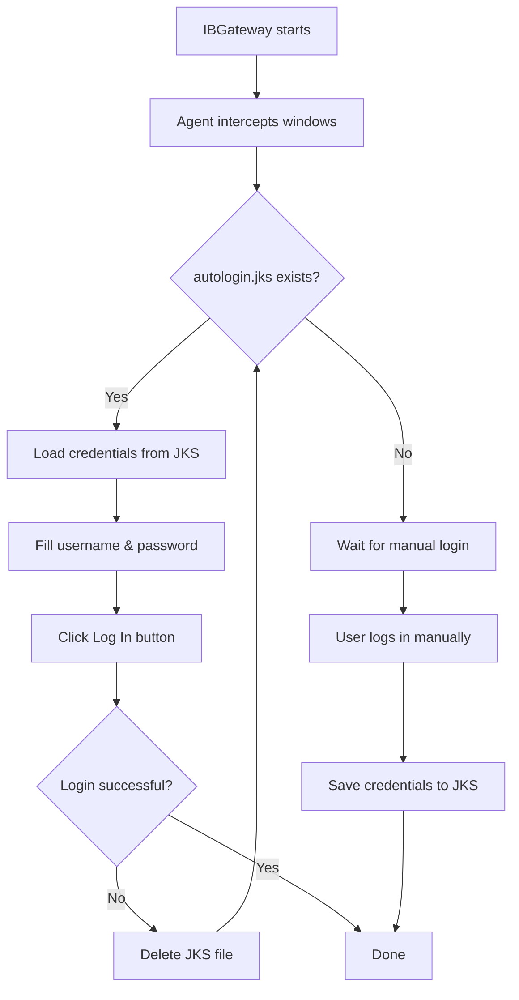

# IBAutoLogin

**IBAutoLogin** is a Java Agent that automates the login process for [Interactive Brokers Gateway (IBGateway)](https://www.interactivebrokers.com/). It securely stores credentials in a PKCS#12 keystore and automatically fills the login form on subsequent launches.

<video src="https://github.com/user-attachments/assets/a8e4cfdd-6a12-45b1-b6ca-9904e52ab498"></video>

## How It Works



## Features

- **Zero-config first run** — no JKS file? The agent waits for a successful manual login and saves credentials automatically
- **Fully automatic afterwards** — on subsequent launches, the form is filled and submitted instantly
- **Secure storage** — credentials are kept in an encrypted PKCS#12 keystore (`autologin.jks`)
- **Self-healing** — if auto-login fails (e.g., password changed), the JKS is cleared and the agent waits for a new manual login
- **Error detection** — reacts to IBGateway error dialogs ("Unrecognized Username or Password") by clearing stored credentials

## Requirements

- Java 17+
- Interactive Brokers Gateway (IBGateway) or TWS

## Installation

You can download the latest release from [GitHub releases](https://github.com/justprodev/IBAutoLogin/releases).

### 1. Build from source

```bash
./gradlew build
```

### 2. Copy the JAR to IBGateway

Copy `IBAutoLogin-1.0.2.jar` into the IBGateway `jars` directory:

```
C:\Jts\ibgateway\1046\jars\IBAutoLogin-1.0.2.jar
```

> **Note:** Adjust the path according to your IBGateway version (e.g., `1046`).

### 3. Configure the Java Agent

Add the following lines to `ibgateway.vmoptions` (e.g., `C:\Jts\ibgateway\1046\ibgateway.vmoptions`):

```properties
### IBAutoLogin
-javaagent:C:\Jts\ibgateway\1046\jars\IBAutoLogin-1.0.2.jar
```

### 4. Restart IBGateway

The agent is now active. On the first run, log in manually — credentials will be saved. All subsequent launches will be automatic.

## How It Stores Credentials

Credentials are stored in a **PKCS#12 keystore** file named `autologin.jks` in the IBGateway working directory.

**We strongly recommend enabling two-factor authentication (2FA) using the IBKR mobile app**

## Logging

The agent uses **SLF4J** and writes to the same log output as IBGateway. Look for `[IBAutoLogin]` entries in the IBGateway logs.

## MFA authentication

The agent does not automate multi-factor authentication (MFA) login. After the agent clicks "Login," you will need to manually enter the MFA code. 

**We recommend enabling two-factor authentication (2FA) using the IBKR mobile app (i.e. FACE-ID + touch authorize) so you can complete 2FA without using a computer.**


## License

[MIT](LICENSE) © 2026 [justprodev](https://github.com/justprodev)
